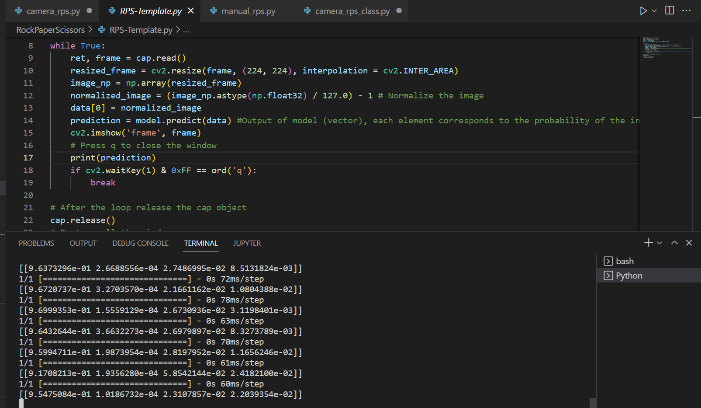

# Computer Vision RPS

### Initial download of the model

This project will use computer vision RPS modelling to create a computer version of the well-known game, 'Rock-Paper-Scissors'. The deep learning model's structure and labels found in files "keras_model.h5" and "labels.txt" were initially generated from the the website,

https://teachablemachine.withgoogle.com/

The classes defined which the machine was trainned to distinguish were the 3 different states of the game itself ('Rock', 'Paper' and 'Scissors') and the 'Nothing' state. The model used images of me gesturing in the appripriate manner corresponding to whcih class was being defined. For instance, a fist was held up to the camera when defining the 'Rock' class. 100 images of each state to allow for a more accurate prediction from the model.

We begin be creating the conda environment so that the machine lerning model we have can run. Within this environment, we imported the packages; opencv-python, tensorflow, and ipykernel. We achieved this by first installing 'pip' in the command prompt, then using this to install the other packages. This environment is named "rps_env" and was created with the following lines of code in the command prompt: 

```
conda create -n rps_env
```

After this, activate the environment and install the the desired packages using pip by:

```
pip install <package name>
```

Once finished, a text file was created which contains the required packages to run the keras model that is presented in this project. The text file is named 'requirements.txt' and was created using the following line of code in the command prompt:

```
pip list > requirements.txt
```

### Manual version of the game

A manual version of the game was created which does not require the use of machine learning to gather an input from the player. Instead, the player types in their desired action when the file is run and they against the computer, who's decision is made at random before the player's. The code for this is found in the file named,
manual_rps.py. The logic of the game is based upon simple if-elif-else commands.

### Machine-Learning version of the game

The next step in this project was to incorporate the keras model that we had previously obtained into the game code and use it to determine the user's decisions via a camera. The player would gesture with their hands into the camera which game state they desired, ie if they wanted to play rock, paper or scissors. The machine learning algorithm would then output a vector that contained the probability that the input contained the corresponding image. An example of this can be found in the following image which demonstrates the probability vector output.



The player's decision is determined by the maximum value of the elements of the produced vactor. This is interpreted as the most likely image being shown to the camera. The game's winner is determined by the first participant to reach 3 wins. Once the model was correctly incorporated into the game, further additions were made to improve the gaming experience. One such improvement was the introductions of a timer for the player to make a desicion when making a move. This timer required the 'time' package and needed to be imported before use. The final code for this game is found in file 'camera_rps.py'.

A further improvement was made to the code with the compartmentalization of the functions defined into a single class which refers to the game inputs and logic. This refined version can be found in file 'camera_rps_class.py'.
